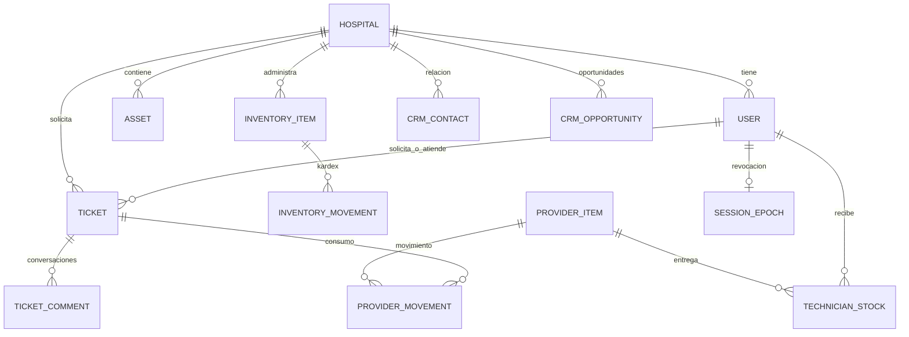

# Diagrama funcional de datos — HospitalOps 1.1

## Aislamiento

- `hospitals`: un registro por cliente hospital.
- `users`: `hospital_id` apunta al hospital para personal y solicitantes del cliente; `NULL` para roles de **empresa prestadora** (`superadmin`, `coordinador_global`, `tecnico_global`).
- `departments`, `assets`, `tickets`, `inventory_items`, `inventory_movements`, `stock_counts`, `crm_contacts`, `crm_opportunities`, `audit_logs` incorporan referencia a `hospital_id` según corresponda.
- `tickets` referencia a `requester_id`, `assignee_id` (puede ser técnico multihospital), `confirmed_by_id` y `asset_id`.
- `ticket_comments` referencia al ticket, no duplica `hospital_id`: el acceso se valida a través del ticket.
- `provider_items` es la bodega propiedad de la empresa, independiente de todos los hospitales.
- `technician_stock` lleva stock distribuido por técnico global (unicidad `item_id + technician_id`).
- `provider_movements` registra entradas, salidas, asignaciones, devoluciones y consumos asociados opcionalmente a un ticket/hospital.
- `login_attempts` registra identificadores hash para rate limiting persistente.
- `session_epochs` revoca todas las sesiones cuando cambia la contraseña del usuario.

## Diagrama Mermaid

## Reglas

Todos los handlers hospitalarios consultan recursos usando `hospital_id`; un técnico de empresa solo puede recuperar tickets donde `assignee_id` coincide con su usuario; no recibe acceso general a inventarios hospitalarios ni al CRM. Las transacciones sobre repuestos centrales bloquean el producto en PostgreSQL y validan cantidades no negativas. Un administrador hospitalario no puede crear roles globales.
