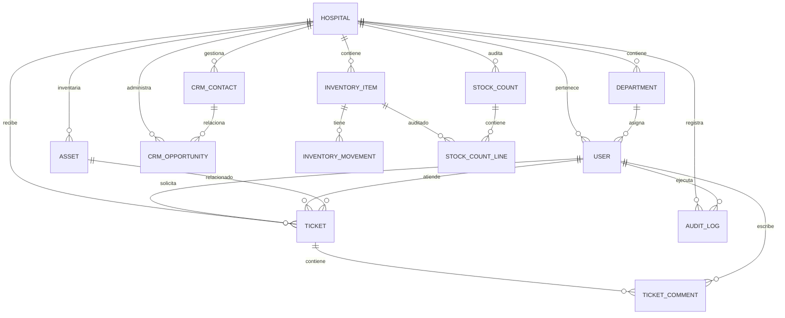

# Modelo de datos y relaciones

La base es relacional, con claves primarias numéricas, referencias foráneas y `hospital_id` en cada tabla de operación. El esquema inicial se crea con `Base.metadata.create_all()`; también se entrega `schema.sql` como referencia para SQLite.

## Datos críticos

| Tabla | Propósito | Campos relevantes |
|---|---|---|
| `hospitals` | Institución tenant y branding | `code`, `active`, `color`, `portal_name`, módulos enabled |
| `users` | Autenticación y RBAC | `hospital_id`, `department_id`, `role`, `approval`, `job_title`, `active`, password hash |
| `departments` | Servicio o departamento hospitalario | `hospital_id`, `name` |
| `tickets` | Mesa de ayuda | `hospital_id`, `requester_id`, `assignee_id`, `confirmed_by_id`, `status`, `priority` |
| `ticket_comments` | Conversación y notas internas | `ticket_id`, `author_id`, `internal` |
| `assets` | Equipos físicos y series | `hospital_id`, `code`, `serial_number`, `location` |
| `inventory_items` | Productos fungibles y repuestos | `hospital_id`, `sku`, `barcode`, `gross_cost`, `sale_price`, `stock`, `min_stock` |
| `inventory_movements` | Kardex auditable | `item_id`, `kind`, `delta`, `resulting_stock`, `ticket_id`, `note` |
| `stock_counts` | Cabecera de conteo físico | `hospital_id`, `status`, `created_by_id`, `closed_at` |
| `stock_count_lines` | Snapshot y resultado contado | `stock_count_id`, `item_id`, `expected_stock`, `actual_stock` |
| `crm_contacts` | Contactos de relaciones comerciales | `hospital_id`, `name`, `job_title`, `department` |
| `crm_opportunities` | Pipeline por etapa | `hospital_id`, `contact_id`, `owner_id`, `stage`, `value` |
| `audit_logs` | Registro operacional | `hospital_id`, `actor_id`, `action`, `entity`, `entity_id` |

**Integridad:** se restringe SKU, código de equipo y nombre de departamento por hospital (índices únicos compuestos). Las claves externas se validan también en lógica de negocio: no basta con que el ID exista, debe ser del hospital activo. No se realizan borrados físicos de hospitales ni usuarios, para conservar trazabilidad.
